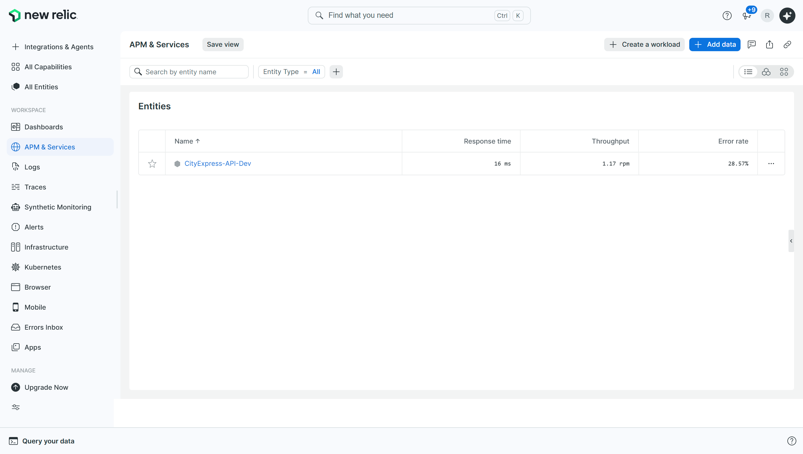
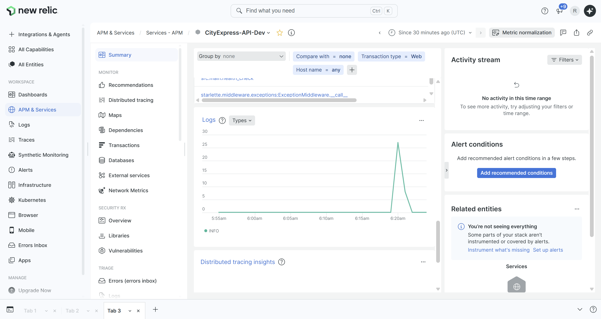
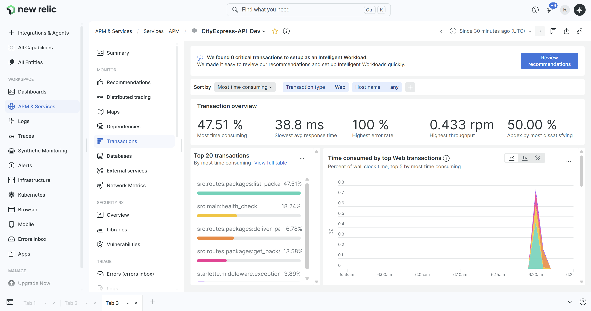
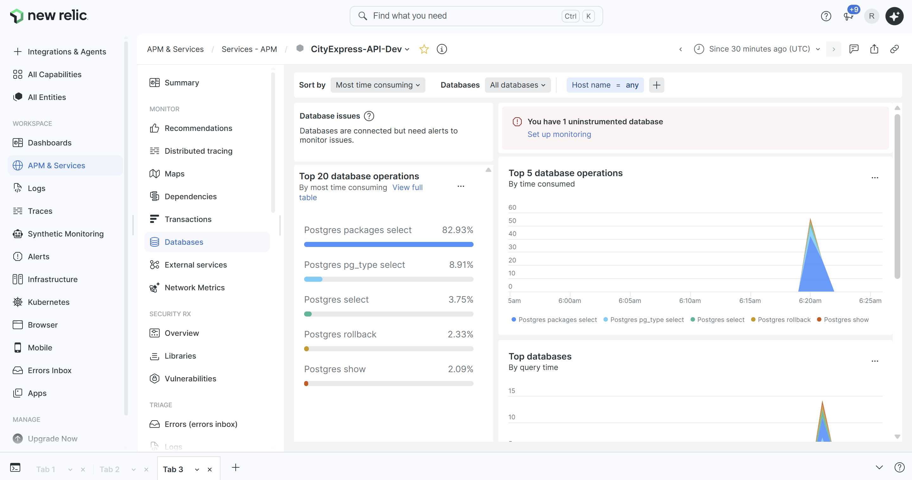
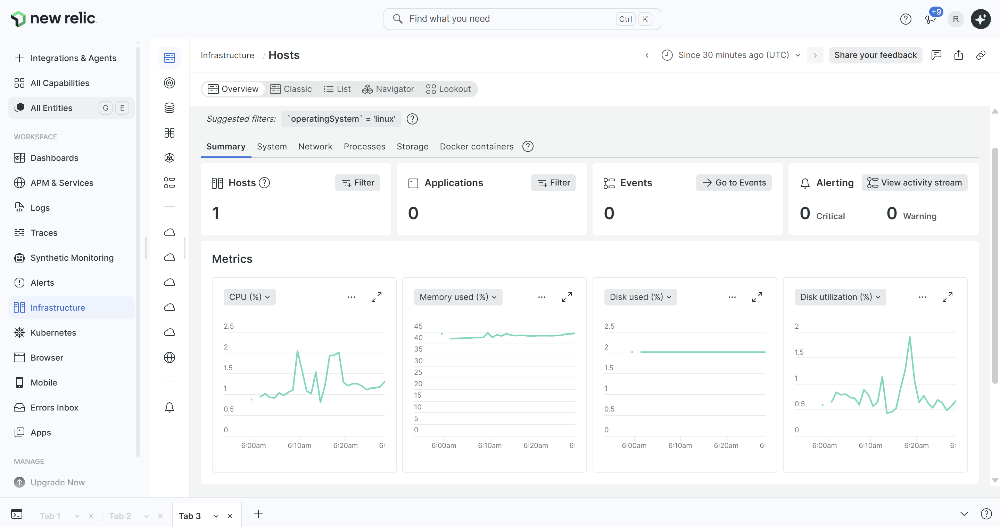
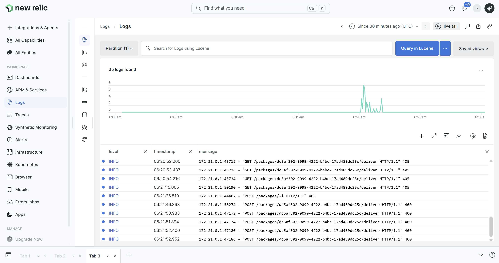

# RDOC02: Documentación de Monitoreo con New Relic

## Descripción General
Este documento describe los pasos necesarios para instalar, configurar y verificar el monitoreo de la aplicación CityExpress-API utilizando New Relic como proveedor SaaS. Se incluye APM (Application Performance Monitoring) para seguimiento de requests HTTP e infraestructura de monitoreo de servidor.

## 1. Prerrequisitos

- **Cuenta New Relic**: Se puede crear una en [New Relic](https://newrelic.com)
- **License Key de New Relic**: Obtenida desde Settings > API keys > Ingest license key
- **Docker y Docker Compose**:  Tener esos archivos instalado en el host
- **Python 3.10+**: En el contenedor (automatizado via Dockerfile)

## 2. Pasos de Instalación

### 2.1 Agregar agente New Relic a dependencias

En `requirements.txt`, agregar:

```txt
newrelic
```

El paquete `newrelic` de Python permite que se capturen las transacciones HTTP y métricas.

### 2.2 Crear archivo de configuración

Crear `newrelic.ini` en la raíz del proyecto y copiar:

```ini
[newrelic]
monitor_mode = true
log_level = info
```
Es el archivo de configuración para inicializar, aunque la license key se pasa por variable de entorno por seguridad.

### 2.3 Modificar Dockerfile

En el `Dockerfile`, copiar `newrelic.ini` y modificar el comando de inicio:

```dockerfile
COPY newrelic.ini /app/newrelic.ini
```

Y en el `CMD`:
```dockerfile
CMD ["sh", "-c", "python3 -c 'from src.database import engine, Base; from src.models import Package, CityConnection, PackageEvent; Base.metadata.create_all(bind=engine)' && newrelic-admin run-program uvicorn src.main:app --host 0.0.0.0 --port 8000 --workers 2"]
```

- `COPY newrelic.ini` garantiza que el archivo exista en el contenedor.
- `newrelic-admin run-program` envuelve el proceso Uvicorn para instrumentarlo con APM permitiendo la captura de información.

### 2.4 Configurar Docker Compose

En `docker-compose.yml`, servicio `api` agregar en cada segmento:

```yaml
api:
  build: .
  container_name: cityexpress_api
  volumes:
    - ./newrelic.ini:/app/newrelic.ini:ro
  environment:
    - NEW_RELIC_CONFIG_FILE=/app/newrelic.ini
    - NEW_RELIC_LICENSE_KEY=${NEW_RELIC_LICENSE_KEY}
    - NEW_RELIC_APP_NAME=CityExpress-API-Dev
```

En `docker-compose.yml`, agregar el servicio de infraestructura:

```yaml
newrelic-infra:
  image: newrelic/infrastructure:latest
  container_name: newrelic-infra
  cap_add:
    - SYS_PTRACE
  network_mode: host
  pid: host
  privileged: true
  environment:
    - NRIA_LICENSE_KEY=${NEW_RELIC_LICENSE_KEY}
  volumes:
    - "/:/host:ro"
    - "/var/run/docker.sock:/var/run/docker.sock"
  restart: unless-stopped
```

- `NEW_RELIC_CONFIG_FILE` apunta a donde está newrelic.ini
- `NEW_RELIC_LICENSE_KEY` autentica con New Relic
- `NEW_RELIC_APP_NAME` identifica la aplicación en New Relic
- El agente de infraestructura monitorea CPU, memoria, disco, docker, etc.

### 2.5 Configurar variables de entorno

En el archivo `.env`, agregar:

```env
NEW_RELIC_LICENSE_KEY=YOUR_LICENSE_KEY_HERE
```

Es importante que reemplaces `YOUR_LICENSE_KEY_HERE` con tu license key real de New Relic.

## 3. Despliegue Local

### 3.1 Construir y levantar contenedores

```bash
sudo docker compose down
sudo docker compose build
sudo docker compose up -d
```

### 3.2 Verificar que los contenedores están corriendo

```bash
sudo docker compose ps
```

Debería mostrar 4 contenedores:
- `cityexpress_api`
- `cityexpress_consumer`
- `cityexpress_db`
- `newrelic-infra`

### 3.3 Revisar logs de APM

```bash
sudo docker compose logs newrelic-infra
sudo docker compose logs newrelic-infra | grep -i docker
```

## 4. Generar Tráfico para Datos

Para que New Relic reciba datos, debes hacer requests a la API:

```bash
# Health check
curl http://localhost:8000/health

# Listar paquetes
curl http://localhost:8000/packages

# Obtener paquete específico
curl http://localhost:8000/packages/{package_id}

# Intentar entrega
curl -X POST http://localhost:8000/packages/{package_id}/deliver
```

Repite estos comandos varias veces (5-10 veces cada uno) para que New Relic tenga suficientes datos para mostrar.

---

## 5. Cómo Ver la Información en New Relic

### 5.1 Acceder a la Dashboard APM

1. Ve a https://one.newrelic.com
2. Inicia sesión con tu cuenta New Relic
3. En el menú superior izquierdo, haz clic en **APM & Services**
4. Deberías ver listada **CityExpress-API-Dev** o **CityExpress-API-Prod** 

### 5.2 Ver Transacciones HTTP

Haz clic en **CityExpress-API-Dev**:

1. **Summary**: Mostará:
   - Web transactions time
   - Apdex score
   - Throughput
   - Error
   - Transactions
   - Logs

2. **Transactions**: Las metricas con respecto a los endpoints:
   - `GET /health`
   - `GET /packages`
   - `GET /packages/{package_id}`
   - `POST /packages/{package_id}/deliver`

3. **Database**: Si accedes a DB, verás queries a PostgreSQL

### 5.3 Ver Infraestructura Monitoreada

1. En el menú izquierdo, ve a **Infrastructure > Hosts**
2. Deberías ver tu servidor/máquina listado
3. Haz clic para ver:
   - CPU %
   - Memory %
   - Disk usage
   - Network I/O

### 5.4 Ver Logs

1. En el menú izquierdo, ve a **Logs**
2. Si hay logs de la aplicación, aparecerán aquí
3. Puedes filtrar por `app_name:CityExpress-API-Dev`

## 6. Despliegue en Producción (EC2)

En `docker-compose.prod.yml`, agregar las mismas variables y servicios:

```yaml
api:
  image: ${API_IMAGE_URI}:latest
  environment:
    - NEW_RELIC_CONFIG_FILE=/app/newrelic.ini
    - NEW_RELIC_LICENSE_KEY=${NEW_RELIC_LICENSE_KEY}
    - NEW_RELIC_APP_NAME=CityExpress-API-Prod

newrelic-infra:
  image: newrelic/infrastructure:latest
  # ... misma configuración que en desarrollo
```

En EC2, agregar al `.env`:
```env
NEW_RELIC_LICENSE_KEY=YOUR_LICENSE_KEY_HERE
```

Luego levantar:
```bash
docker compose -f docker-compose.prod.yml up -d
```

En New Relic, aparecerá como **CityExpress-API-Prod** (aplicación separada).

---

## 7. Troubleshooting

### New Relic no recibe datos

1. Verifica que `NEW_RELIC_LICENSE_KEY` sea correcta:

2. Asegúrate de que generas tráfico (requests HTTP).

3. Espera 2-5 minutos después de generar tráfico; New Relic tiene latencia de reporte.

### APM no aparece en el dashboard

- Confirma que `newrelic-admin run-program` está en el comando del contenedor
- Verifica que `newrelic` esté en `requirements.txt`
- Revisa que el archivo `newrelic.ini` exista en el contenedor

### Infraestructura no aparece

- En Linux, el agente de infraestructura requiere acceso root (privileged: true), por lo que revisa el `docker-compose.prod-yml`.
- Verifica que `NRIA_LICENSE_KEY` sea la misma que `NEW_RELIC_LICENSE_KEY`
- El agente puede tardar 1-2 minutos en reportar

## 8. Evidencias de Monitoreo en New Relic

Las siguientes capturas de pantalla demuestran el funcionamiento completo del monitoreo de CityExpress-API en New Relic:

### APM & Services - Entities

Vista del listado de aplicaciones monitoreadas mostrando **CityExpress-API-Dev**.



### APM & Services - Summary

Dashboard principal de la aplicación mostrando el resumen de transacciones, dependencias y estado general.



### APM & Services - Transactions

Detalle de transacciones HTTP mostrando endpoints (`/health`, `/packages`, `/deliver`) con su tiempo de consumo y distribución.



### APM & Services - Database

Métricas de base de datos mostrando queries a PostgreSQL con estadísticas de rendimiento y operaciones más consumidoras de tiempo.



### Infrastructure - Hosts

Vista de infraestructura con métricas del host (CPU, memoria, disco, I/O).



### Logs

Agregación de logs de la aplicación mostrando transacciones HTTP registradas en New Relic.



## 9. Consideraciones
Algunas modificaciones realizadas a los archivos fueron específicas para probar el monitoreo en desarrollo y podrían diferir de la configuración final utilizada en producción.

Además, para probar el monitoreo es necesario configurar previamente el archivo `.env` con todas las variables de entorno necesarias.

## 10. Bibliografía

1. [New Relic Python Agent Docs](https://docs.newrelic.com/docs/apm/agents/python-agent/getting-started/introduction-new-relic-python/)
2. [New Relic Infrastructure Monitoring](https://docs.newrelic.com/docs/infrastructure/infrastructure-agent/linux-installation/infra-agent-as-container/)
