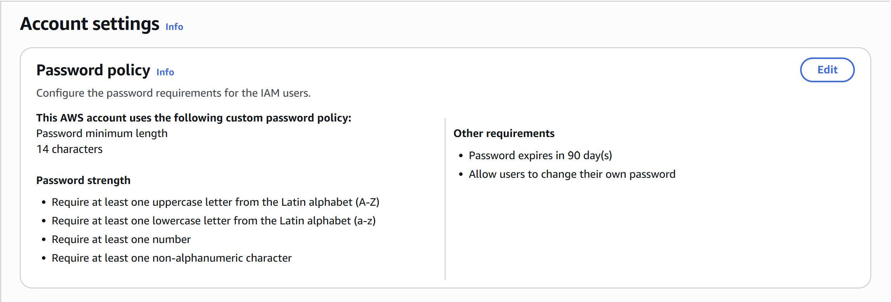
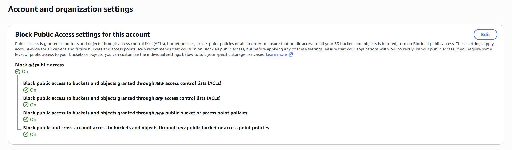
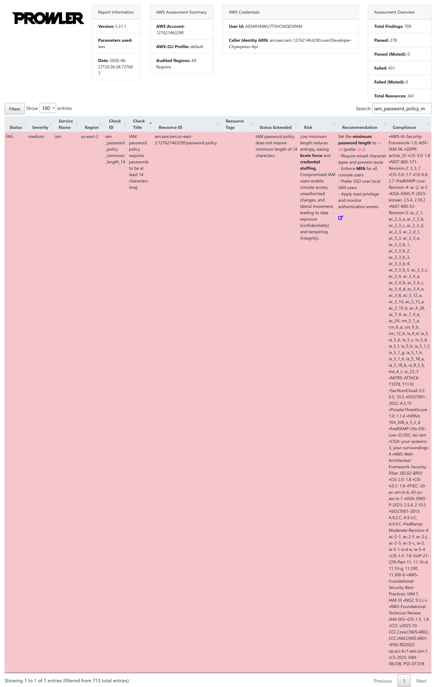
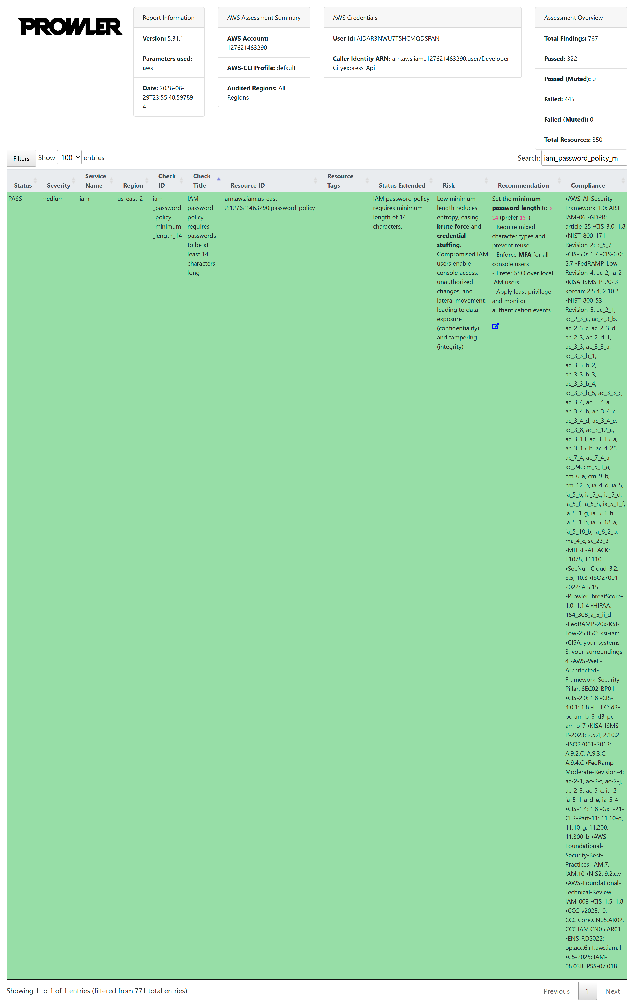
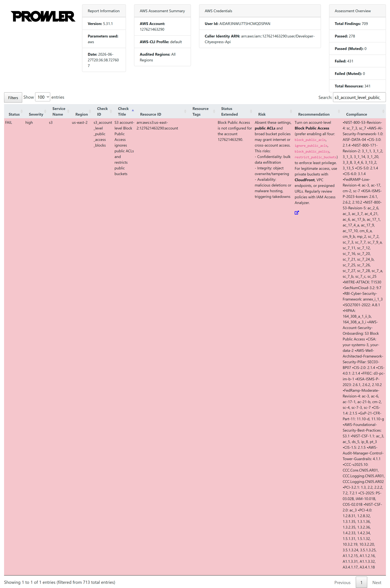
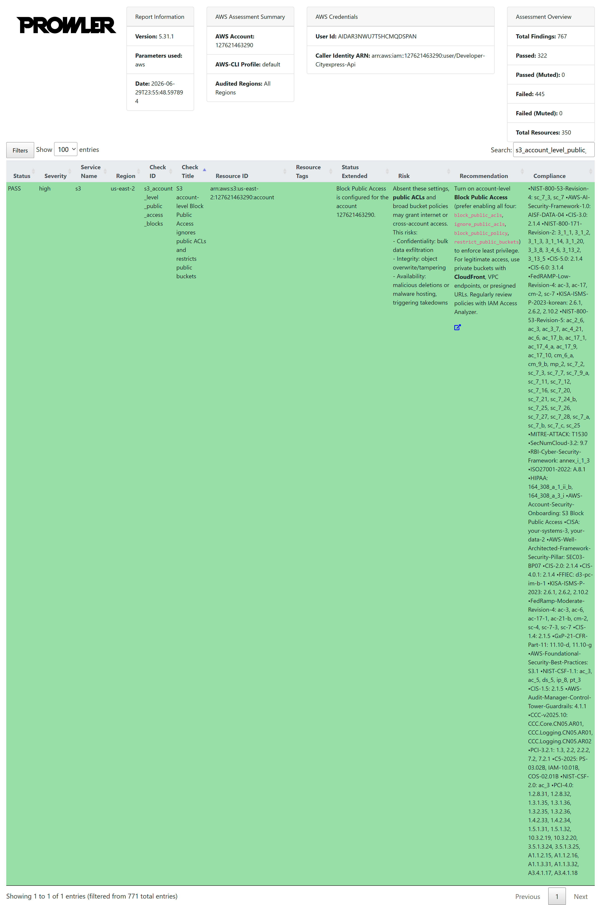
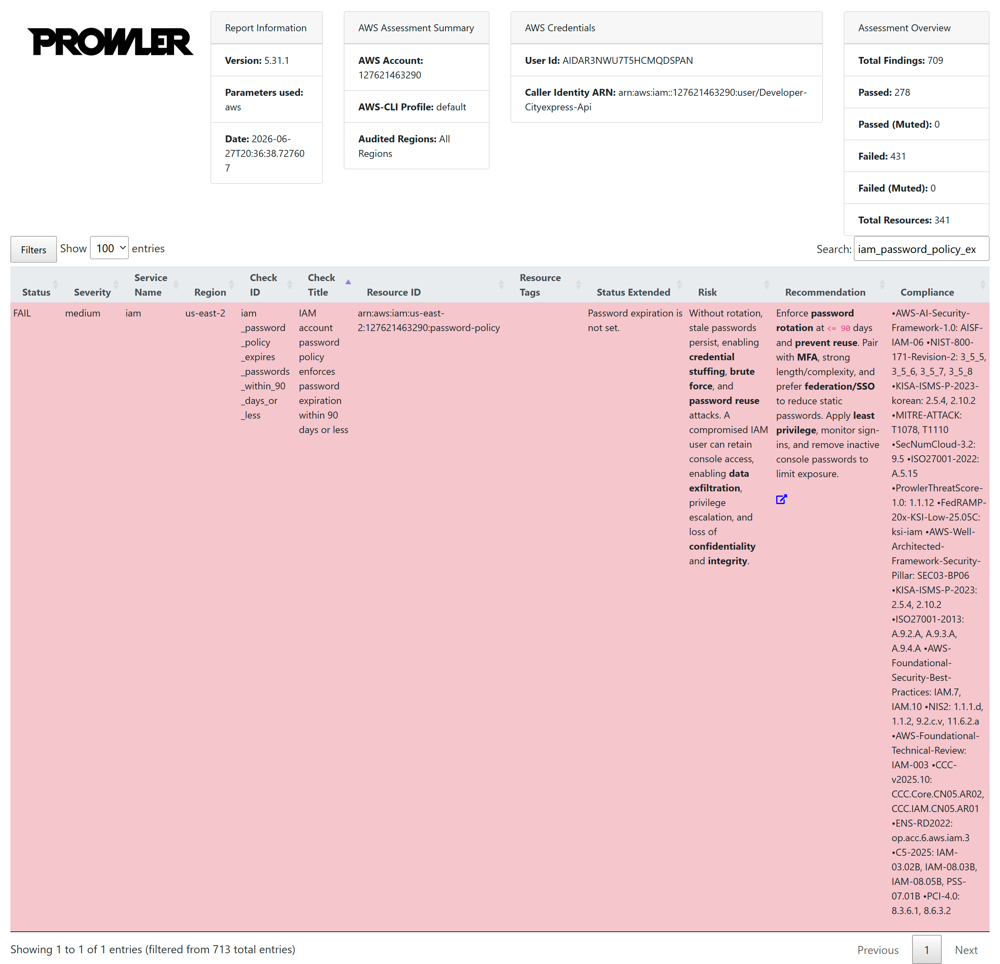
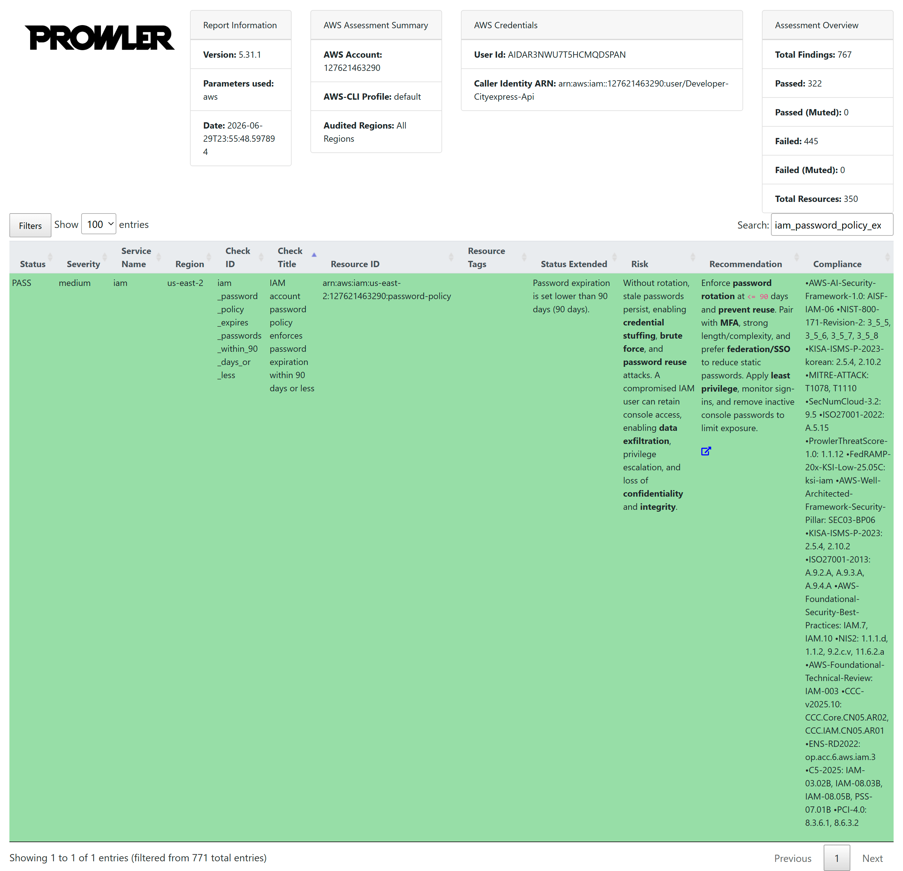

# RNF03 (E3): Reporte de Auditoría de Seguridad con Prowler

## Datos Generales
**Fecha de ejecución:** 27 de Junio de 2026
**Fecha de resolución:** 29 de Junio de 2026
**Herramienta utilizada:** Prowler Cloud CLI  
**Objetivo:** Identificar y remediar al menos 3 vulnerabilidades de seguridad de prioridad *Medium* o superior en la infraestructura de AWS.

## 1. Vulnerabilidad 1: Política de contraseñas de IAM débil
- **Nivel de Severidad:** 🟡 Medium
- **ID del Error:** iam_password_policy_minimum_length_14
- **Servicio de AWS:** IAM
- **Descripción del problema:** No se exige un mínimo de 14 caracteres ni símbolos en las contraseñas de los usuarios.
- **Solución aplicada:** Se modificó la política de contraseñas de la cuenta desde la consola de IAM para exigir al menos un símbolo, un número y 14 caracteres de longitud.

### Evidencia de la corrección

## 2. Vulnerabilidad 2: Acceso público a nivel de cuenta en S3 no bloqueado
- **Nivel de Severidad:** 🔴 High
- **ID del Error:** s3_account_level_public_access_blocks
- **Servicio de AWS:** Amazon S3
- **Descripción del problema:** La cuenta de AWS no tiene activada la restricción global para bloquear el acceso público a los buckets de S3, lo que podría derivar en exposición accidental de datos.
- **Solución aplicada:** Se ingresó a la configuración ``Block Public Access settings for this account`` en la consola de S3 y se activó la opción ``Block all public access``.

### Evidencia de la corrección

## 3. Vulnerabilidad 3: Falta de expiracion obligatoria de contraseñas
- **Nivel de Severidad:** 🟡 Medium
- **ID del Error:** iam_password_policy_expires_passwords_within_90_days
- **Servicio de AWS:** IAM
- **Descripción del problema:** La política de contraseñas de la cuenta no exige que las contraseñas expiren cada 90 días o menos, lo cual aumenta el riesgo de que credenciales comprometidas sean usadas prolongadamente.
- **Solución aplicada:** Se editó la política de contraseñas en ``IAM > Account settings`` para habilitar la expiración obligatoria (``Enable password expiration``) configurándola a 90 días.

### Evidencia de la corrección

## Logs - Prowler Cloud CLI
Se mostraran lo logs generados por Prowler para cada tipo de error y despues de su correcion.
El archivo HTML original generado por Prowler se encuentra adjunto en este repositorio en la ruta

## Vulnerabilidad 1
### Log Inicial

### Log Final

## Vulnerabilidad 2
### Log Inicial

### Log Final

## Vulnerabilidad 3
### Log Inicial

### Log Final

